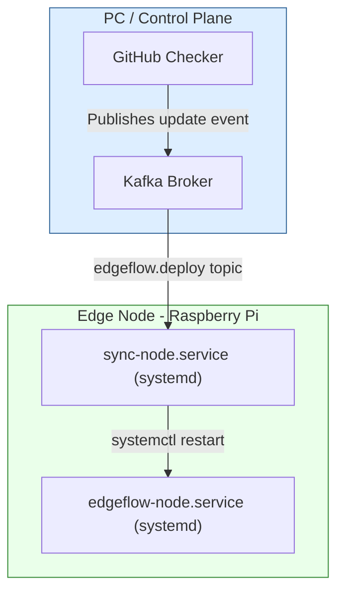

# **EdgeFlow Orchestration Architecture (v1 Overview)**

## **Current Architecture — Phase 1**

### **Components**

| Domain                 | Service                   | Role                                                                               |
| :--------------------- | :------------------------ | :--------------------------------------------------------------------------------- |
| **PC / Control Plane** | **Kafka Broker**          | Central message bus for control events (`edgeflow.deploy`, `edgeflow.status`).     |
|                        | **GitHub Checker**        | Polls GHCR / GitHub for new image tags and publishes `"update"` messages to Kafka. |
| **Edge Node (Pi)**     | **edgeflow-node.service** | Systemd-managed container running the EdgeFlow application.                        |
|                        | **sync-node.service**     | Systemd-managed Python daemon consuming the Kafka topic and triggering redeploys.  |

### **Control Flow**

1. GitHub Checker detects a new image → publishes `{"action":"update","tag":"v1.x.y"}` to Kafka.
2. `sync-node.service` on the Pi consumes that message → runs `docker pull` → triggers `systemctl restart edgeflow-node`.
3. Systemd restarts the container using the latest local image.

**Key traits:**

* Simple, observable, and robust.
* Offline-friendly (systemd always restarts the last known image).
* Fully event-driven through Kafka.

---

## **Future Direction — Phased Evolution**

| Phase             | Orchestration            | Trigger                 | Primary Benefit                         |
| :---------------- | :----------------------- | :---------------------- | :-------------------------------------- |
| **Stage 1 (Now)** | `systemd` on Pi          | Kafka / GHCR checker    | Lightweight, easy to debug              |
| **Stage 2**       | Same model, multiple Pis | Kafka fan-out           | Validates scalability & reliability     |
| **Stage 3**       | K3s / Kubernetes         | Kafka or GitHub Actions | Unified container lifecycle via kubelet |
| **Stage 4**       | Argo CD + GitOps         | Git commit / Helm bump  | Declarative, hands-off rollouts         |

---

### **Migration Notes**

* **From systemd → K3s:** each Pi becomes a K3s agent node running `edgeflow-node` and `sync-node` as Pods.
* **From Kafka → Argo CD:** Argo monitors the Git manifest for image tag changes and reconciles automatically.
* Existing observability and update logic can be reused as Prometheus exporters and Argo health checks.

---

### **Summary**

EdgeFlow currently uses a **systemd-based event-driven deployment loop** for simplicity and resilience.
The design naturally evolves toward **K3s + Argo CD**, where orchestration becomes declarative and Git-driven while preserving the same operational principles.
